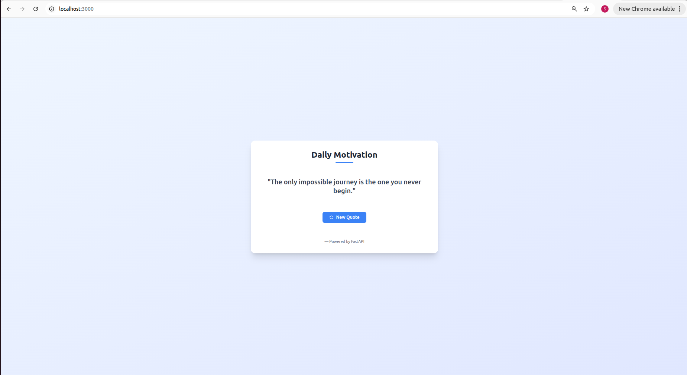
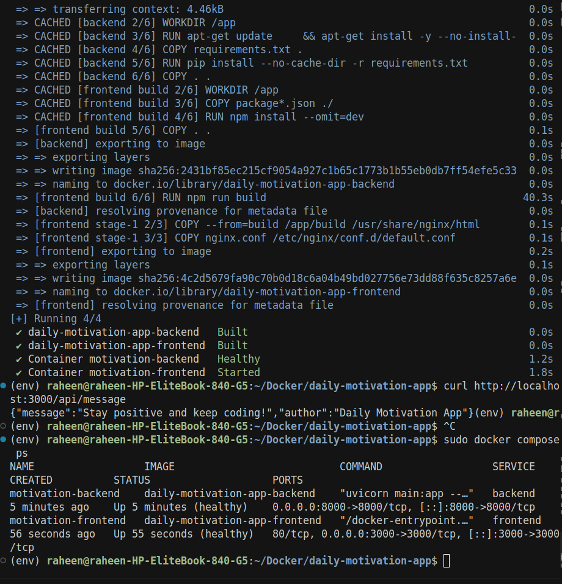

# Motivational App Using Docker


*Beautiful, responsive Daily Motivation App interface*


*Docker containers running successfully*

A full-stack web application that provides daily motivational quotes, built with React frontend and FastAPI backend, containerized with Docker. This project demonstrates modern web development practices with microservices architecture, containerization, and responsive design.

## 📋 Table of Contents

- [Features](#-features)
- [Architecture](#-architecture)
- [Technologies Used](#-technologies-used)
- [Project Structure](#-project-structure)
- [Prerequisites](#-prerequisites)
- [Quick Start](#-quick-start)
- [Detailed Setup](#-detailed-setup)
- [API Documentation](#-api-documentation)
- [Development Guide](#-development-guide)
- [Docker Commands](#-docker-commands)
- [Configuration](#-configuration)
- [Customization](#-customization)
- [Deployment](#-deployment)
- [Troubleshooting](#-troubleshooting)
- [Contributing](#-contributing)
- [License](#-license)

## ✨ Features

### Frontend Features
- **🎨 Modern UI**: Clean, professional design with Tailwind CSS
- **📱 Responsive Design**: Works perfectly on desktop, tablet, and mobile devices
- **🎭 Smooth Animations**: Hover effects, loading states, and smooth transitions
- **🔄 Interactive Elements**: "New Quote" button for fresh inspiration
- **⚡ Fast Loading**: Optimized React build with code splitting
- **🎯 Error Handling**: Graceful fallbacks for API failures with user-friendly messages

### Backend Features
- **🚀 FastAPI**: High-performance Python web framework
- **📊 RESTful API**: Clean, well-documented endpoints
- **🎲 Random Quotes**: Curated collection of 10+ motivational quotes
- **🏥 Health Checks**: Built-in health monitoring endpoints
- **🔒 CORS Support**: Proper cross-origin resource sharing configuration
- **📝 Auto Documentation**: Interactive API docs with Swagger UI

### DevOps Features
- **🐳 Docker**: Complete containerization of both services
- **🔄 Docker Compose**: Multi-container orchestration
- **🌐 Nginx**: Production-ready web server with reverse proxy
- **💚 Health Monitoring**: Container health checks and auto-restart
- **🔧 Hot Reload**: Development-friendly with live updates

## 🏗️ Architecture

```
┌─────────────────────────────────────────────────────────────┐
│                    Daily Motivation App                     │
├─────────────────────────────────────────────────────────────┤
│  Frontend (React + Tailwind)  │  Backend (FastAPI)         │
│  ┌─────────────────────────┐   │  ┌─────────────────────┐   │
│  │  • Responsive UI        │   │  │  • REST API         │   │
│  │  • Interactive Cards   │◄──►│  │  • Quote Database   │   │
│  │  • Smooth Animations   │   │  │  • Health Checks     │   │
│  │  • Error Handling      │   │  │  • CORS Support      │   │
│  └─────────────────────────┘   │  └─────────────────────┘   │
│  Port: 3000 (Nginx)            │  Port: 8000 (Uvicorn)       │
├─────────────────────────────────────────────────────────────┤
│                    Docker Network                           │
│  ┌─────────────────────────────────────────────────────┐   │
│  │  • Container Orchestration                         │   │
│  │  • Service Discovery                               │   │
│  │  • Health Monitoring                               │   │
│  │  • Auto-restart on Failure                         │   │
│  └─────────────────────────────────────────────────────┘   │
└─────────────────────────────────────────────────────────────┘
```

## 🛠️ Technologies Used

### Frontend Stack
- **React 18**: Latest React with hooks and functional components
- **Tailwind CSS**: Utility-first CSS framework for rapid UI development
- **PostCSS**: CSS processing with autoprefixer
- **Nginx**: Production web server with reverse proxy
- **Node.js 18**: JavaScript runtime for build process

### Backend Stack
- **FastAPI**: Modern, fast web framework for building APIs
- **Python 3.11**: Latest Python with async/await support
- **Uvicorn**: ASGI server for FastAPI
- **Pydantic**: Data validation using Python type annotations

### DevOps & Infrastructure
- **Docker**: Containerization platform
- **Docker Compose**: Multi-container application orchestration
- **Nginx**: High-performance web server and reverse proxy
- **Health Checks**: Container and service monitoring

## 📁 Project Structure

```
daily-motivation-app/
├── 📁 backend/                    # FastAPI Backend Service
│   ├── 🐍 main.py                # Main FastAPI application
│   ├── 📋 requirements.txt       # Python dependencies
│   └── 🐳 Dockerfile            # Backend container configuration
├── 📁 frontend/                   # React Frontend Service
│   ├── 📁 src/                   # React source code
│   │   ├── ⚛️ App.js            # Main React component
│   │   ├── 🎨 App.css           # Custom styles
│   │   ├── ⚛️ index.js          # React entry point
│   │   └── 🎨 index.css          # Tailwind CSS imports
│   ├── 📁 public/                # Static assets
│   │   ├── 🖼️ Frontend_app.png  # App screenshot
│   │   ├── 🖼️ Container_running.png # Docker screenshot
│   │   └── 📄 index.html        # HTML template
│   ├── 📦 package.json           # Node.js dependencies
│   ├── ⚙️ tailwind.config.js    # Tailwind configuration
│   ├── ⚙️ postcss.config.js     # PostCSS configuration
│   ├── 🌐 nginx.conf            # Nginx configuration
│   └── 🐳 Dockerfile            # Frontend container configuration
├── 🐳 docker-compose.yml         # Multi-container orchestration
└── 📖 README.md                 # Project documentation
```

## 📋 Prerequisites

Before running this application, ensure you have the following installed:

### Required Software
- **Docker**: Version 20.10+ ([Install Docker](https://docs.docker.com/get-docker/))
- **Docker Compose**: Version 2.0+ (included with Docker Desktop)
- **Git**: For cloning the repository

### System Requirements
- **RAM**: Minimum 2GB available
- **Storage**: At least 1GB free space
- **OS**: Linux, macOS, or Windows with WSL2

### Optional (for development)
- **Node.js**: Version 18+ for local frontend development
- **Python**: Version 3.11+ for local backend development
- **Code Editor**: VS Code, WebStorm, or similar

## 🚀 Quick Start

### 1. Clone the Repository
```bash
git clone <repository-url>
cd daily-motivation-app
```

### 2. Start the Application
```bash
# Build and start all services
sudo docker compose up --build -d

# Or without sudo (if user is in docker group)
docker compose up --build -d
```

### 3. Access the Application
- **🌐 Frontend**: http://localhost:3000
- **🔧 Backend API**: http://localhost:8000
- **📚 API Documentation**: http://localhost:8000/docs
- **🔍 Health Check**: http://localhost:8000/health

### 4. Verify Installation
```bash
# Check container status
sudo docker compose ps

# Test API endpoint
curl http://localhost:8000/api/message

# Test frontend
curl -I http://localhost:3000
```

## 🔧 Detailed Setup

### Docker Installation

#### Ubuntu/Debian
```bash
# Update package index
sudo apt-get update

# Install Docker
sudo apt-get install docker.io docker-compose

# Add user to docker group
sudo usermod -aG docker $USER

# Logout and login again
```

#### macOS
```bash
# Install Docker Desktop
brew install --cask docker

# Or download from: https://www.docker.com/products/docker-desktop
```

#### Windows
```bash
# Install Docker Desktop
# Download from: https://www.docker.com/products/docker-desktop
```

### Environment Setup

#### Backend Environment
```bash
cd backend
python -m venv venv
source venv/bin/activate  # On Windows: venv\Scripts\activate
pip install -r requirements.txt
```

#### Frontend Environment
```bash
cd frontend
npm install
```

## 📚 API Documentation

### Base URL
- **Development**: http://localhost:8000
- **Production**: http://your-domain.com

### Endpoints

#### 1. Get Random Motivational Quote
```http
GET /api/message
```

**Response:**
```json
{
  "message": "Stay positive and keep coding!",
  "author": "Daily Motivation App"
}
```

#### 2. API Status
```http
GET /
```

**Response:**
```json
{
  "message": "Daily Motivation API is running!"
}
```

#### 3. Health Check
```http
GET /health
```

**Response:**
```json
{
  "status": "healthy"
}
```

### Interactive Documentation
- **Swagger UI**: http://localhost:8000/docs
- **ReDoc**: http://localhost:8000/redoc

## 💻 Development Guide

### Backend Development

#### Local Development
```bash
cd backend
python -m venv venv
source venv/bin/activate
pip install -r requirements.txt
uvicorn main:app --reload --host 0.0.0.0 --port 8000
```

#### Adding New Quotes
Edit `backend/main.py`:
```python
MOTIVATIONAL_QUOTES = [
    "Your new inspirational quote here!",
    # ... existing quotes
]
```

#### Adding New Endpoints
```python
@app.get("/api/new-endpoint")
async def new_endpoint():
    return {"message": "New endpoint response"}
```

### Frontend Development

#### Local Development
```bash
cd frontend
npm install
npm start
```

#### Styling Changes
- Modify Tailwind classes in `src/App.js`
- Add custom CSS in `src/App.css`
- Update `tailwind.config.js` for theme customization

#### Adding New Components
```jsx
// Create new component
const NewComponent = () => {
  return <div>New Component</div>;
};

// Import and use in App.js
import NewComponent from './NewComponent';
```

## 🐳 Docker Commands

### Basic Commands
```bash
# Build and start all services
sudo docker compose up --build

# Start in background (detached mode)
sudo docker compose up -d

# Stop all services
sudo docker compose down

# View logs
sudo docker compose logs -f

# View logs for specific service
sudo docker compose logs -f frontend
sudo docker compose logs -f backend
```

### Development Commands
```bash
# Rebuild specific service
sudo docker compose up --build frontend
sudo docker compose up --build backend

# Start only backend
sudo docker compose up backend

# Start only frontend
sudo docker compose up frontend

# Remove all containers and volumes
sudo docker compose down -v

# Remove all images
sudo docker compose down --rmi all
```

### Debugging Commands
```bash
# Execute shell in running container
sudo docker compose exec frontend sh
sudo docker compose exec backend bash

# Check container health
sudo docker compose ps

# View resource usage
sudo docker stats

# Inspect container configuration
sudo docker inspect motivation-frontend
```

## ⚙️ Configuration

### Environment Variables

#### Backend Configuration
```bash
# In backend/Dockerfile or docker-compose.yml
ENV PYTHONUNBUFFERED=1
ENV PYTHONDONTWRITEBYTECODE=1
```

#### Frontend Configuration
```bash
# In frontend/package.json
"proxy": "http://backend:8000"
```

### Nginx Configuration
The frontend uses Nginx for production serving. Key configurations:

```nginx
# Listen on port 3000
listen 3000;

# Handle React Router
location / {
    try_files $uri $uri/ /index.html;
}

# Proxy API requests to backend
location /api/ {
    proxy_pass http://backend:8000/api/;
}
```

### Docker Compose Configuration
```yaml
services:
  backend:
    build: ./backend
    ports:
      - "8000:8000"
    healthcheck:
      test: ["CMD", "curl", "-f", "http://localhost:8000/health"]
      interval: 30s
      timeout: 10s
      retries: 3
```

## 🎨 Customization

### Adding New Quotes
1. Edit `backend/main.py`
2. Add quotes to `MOTIVATIONAL_QUOTES` list
3. Rebuild backend container:
   ```bash
   sudo docker compose up --build backend
   ```

### Changing UI Theme
1. Edit `frontend/tailwind.config.js`
2. Modify color palette:
   ```javascript
   theme: {
     extend: {
       colors: {
         'primary': '#your-color',
         'secondary': '#your-color',
       }
     }
   }
   ```

### Adding New API Endpoints
1. Edit `backend/main.py`
2. Add new FastAPI routes
3. Update frontend to call new endpoints
4. Rebuild both services

### Database Integration
To add a database (PostgreSQL example):

1. Add to `docker-compose.yml`:
   ```yaml
   services:
     database:
       image: postgres:15
       environment:
         POSTGRES_DB: motivation_db
         POSTGRES_USER: user
         POSTGRES_PASSWORD: password
   ```

2. Update backend to use database
3. Add database dependencies to `requirements.txt`

## 🚀 Deployment

### Production Deployment

#### Using Docker Compose
```bash
# Build production images
sudo docker compose -f docker-compose.prod.yml up --build -d

# Use environment variables
export POSTGRES_PASSWORD=your-secure-password
sudo docker compose up -d
```

#### Using Docker Swarm
```bash
# Initialize swarm
sudo docker swarm init

# Deploy stack
sudo docker stack deploy -c docker-compose.yml motivation-app
```

#### Using Kubernetes
```bash
# Convert to Kubernetes manifests
kompose convert

# Apply to cluster
kubectl apply -f .
```

### Environment-Specific Configurations

#### Development
```yaml
# docker-compose.dev.yml
services:
  backend:
    volumes:
      - ./backend:/app
    environment:
      - DEBUG=true
```

#### Production
```yaml
# docker-compose.prod.yml
services:
  backend:
    environment:
      - DEBUG=false
      - DATABASE_URL=postgresql://...
```

## 🔧 Troubleshooting

### Common Issues

#### 1. Port Already in Use
```bash
# Check what's using the port
sudo lsof -i :3000
sudo lsof -i :8000

# Kill the process
sudo kill -9 <PID>

# Or change ports in docker-compose.yml
```

#### 2. Permission Denied (Docker)
```bash
# Add user to docker group
sudo usermod -aG docker $USER

# Logout and login again
# Or use sudo for commands
sudo docker compose up
```

#### 3. Container Won't Start
```bash
# Check logs
sudo docker compose logs frontend
sudo docker compose logs backend

# Check container status
sudo docker compose ps

# Restart specific service
sudo docker compose restart frontend
```

#### 4. Frontend Can't Connect to Backend
```bash
# Check if backend is running
curl http://localhost:8000/health

# Check nginx configuration
sudo docker compose exec frontend cat /etc/nginx/conf.d/default.conf

# Test API through nginx proxy
curl http://localhost:3000/api/message
```

#### 5. Build Failures
```bash
# Clear Docker cache
sudo docker system prune -a

# Rebuild without cache
sudo docker compose build --no-cache

# Check Dockerfile syntax
sudo docker build -t test ./backend
```

### Debugging Commands

#### Container Debugging
```bash
# Access container shell
sudo docker compose exec backend bash
sudo docker compose exec frontend sh

# Check container processes
sudo docker compose exec backend ps aux

# Check container network
sudo docker compose exec backend ping frontend
```

#### Log Analysis
```bash
# Follow logs in real-time
sudo docker compose logs -f

# Filter logs by service
sudo docker compose logs -f backend | grep ERROR

# Export logs to file
sudo docker compose logs > app-logs.txt
```

#### Network Debugging
```bash
# Check Docker networks
sudo docker network ls
sudo docker network inspect daily-motivation-app_motivation-network

# Test connectivity between containers
sudo docker compose exec backend curl http://frontend:3000
```

## 🤝 Contributing

### Development Workflow
1. Fork the repository
2. Create a feature branch: `git checkout -b feature/amazing-feature`
3. Make your changes
4. Test thoroughly
5. Commit changes: `git commit -m 'Add amazing feature'`
6. Push to branch: `git push origin feature/amazing-feature`
7. Open a Pull Request

### Code Standards
- **Python**: Follow PEP 8 style guide
- **JavaScript**: Use ESLint configuration
- **CSS**: Follow Tailwind CSS best practices
- **Docker**: Use multi-stage builds for optimization

### Testing
```bash
# Backend tests
cd backend
python -m pytest

# Frontend tests
cd frontend
npm test

# Integration tests
sudo docker compose -f docker-compose.test.yml up --build
```

## 📄 License

This project is licensed under the MIT License - see the [LICENSE](LICENSE) file for details.

## 🙏 Acknowledgments

- **React Team** for the amazing frontend framework
- **FastAPI Team** for the high-performance Python framework
- **Tailwind CSS** for the utility-first CSS framework
- **Docker Team** for containerization technology
- **Open Source Community** for inspiration and support

## 📞 Support

If you encounter any issues or have questions:

1. **Check the troubleshooting section** above
2. **Search existing issues** in the repository
3. **Create a new issue** with detailed information
4. **Contact the maintainers** for urgent issues

---

**Made with ❤️ and lots of ☕ by the development team**

*Stay motivated and keep coding!* 🚀


